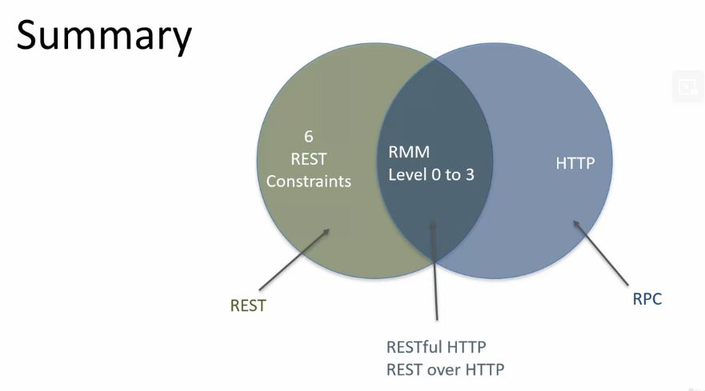

# Section 03 - REST API Architectural Constraints

# What I Learned

- Just because you add HTTP and JSON together, you don't necessarily have RESTful architecture.
    - It can be **REST like** or **RESTish**

- What makes Architecture RESTful?
    - It must follow **6** Design Rules. 
        - These rules are called **REST Architecture Constraints**

- In summary these are

1. Client - Server
    - Use Client/Server design principles 
2. Uniform Interface 
    - Use of well-defined contracts between **client** and the **server**
3. Statelessness
    - Server should not manage state of application
4. Caching 
    - HTTP Caching header to cache responses to requests
5. Layers
    - Architecture should be layered
6. Code on Demand (optional)
    - Server can send code to client 

- Rest API are not restricted to HTTP. This can be said `REST over HTTP`

- RESTfullness of API implementation

### 1. Client - Server constraint explained 

- Client request **resource**
- Server responses with **resource**
    - Server may serve multiple resources
    - Serves multiple clients
- Client and Server NOT run in same process

- Over network, client and server can change independently
    - As long **Uniform Interface** is 

- These marks are fully taken care of as long **Uniform Interface** is maintained!

- Client and Server can evolve independently
    2. At first Servers provided resource as **XML** format
    1. Then came need for support **JSON**
    3. In future came **CSV file format** 
    - THIS IS POSSIBLE ONLY IF **Uniform Interface** is being valued!

### 2. Client - Server constraint explained 
- todo
### 3. Client - Server constraint explained
- todo 
### 4. Client - Server constraint explained 
- todo
### 5. Client - Server constraint explained
- todo

### 6. Code On Demand - REST API Architectural Constraint

- Server can send code to client

- When client asks server `hmtl` its returned from `server`. In REST context `<Response>` is sent back instead of `<html>`
    - This can be other `.filetypes`

2. Client can execute this in their machine

- `HATEOAS` is something as **Code on demand**

2. REST client can take action on links coming from `<Response>` and apply them on **resources** manged on ***Rest Server**

1. Repose is returned with different **links**, client can **Invoke** these links, which in return get executed in server side. Hence, **server** can manage content of Vacation

2. Let's say, requested resource is booked out. Server can manage response(Link) given in returned resource.

- PayPal implements HATEOES as such [PayPal HATEOES](https://developer.paypal.com/api/rest/responses/#link-hateoaslinks)

1. Link 1, link about this payment transaction
2. Link 2, Carrying refund of trans action
3. Link 3, Get parent transaction of this transaction
