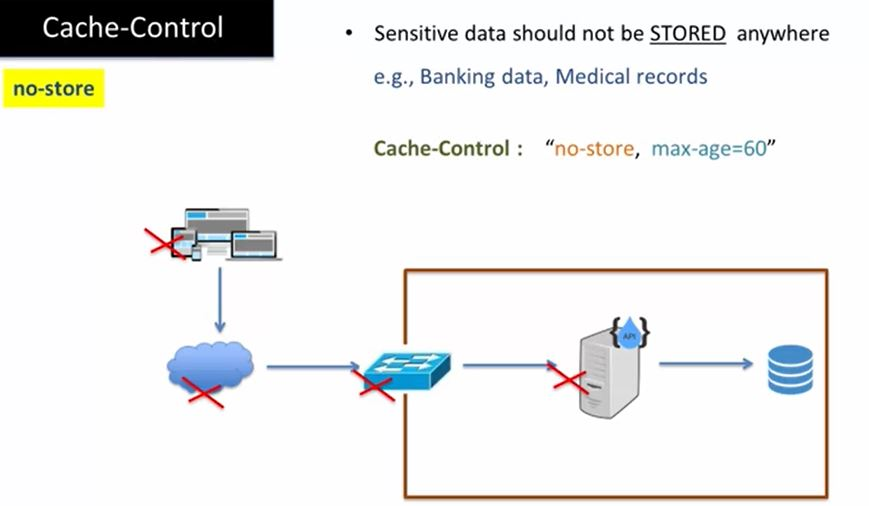

# Section 07 - REST API Cache Control Patterns

Caching behavior 

# What I Learned

1. Before entering to enterprise environment, gateway can **transform data** or perform **ssl offload**
2. Any of these can **cache data**

2. Scalability and thought put is greatly enchanted!
3. Bottleneck in this scenario **50 calls/second**

> The primary difference between **horizontal scaling** and **vertical scaling** is that **horizontal scaling** involves adding **more machines or nodes to a system**, while **vertical scaling** involves adding more power **(CPU, RAM, storage, etc.) to an existing machine**.

4. No help to scale horizontally or vertically at **mid-tier**. Since problem is the db.
    - You can **cache** at **mid-tier**

- You can **cache** at any tier. **Closer** caching is done to **consumer** the faster the performance

## When deciding what to cache form Data perspective 

1. When deciding what to cache, you need to the **three factors**
    - **Speed of change**
    - **Time sensitivity**
    - **Security**

2. Static content like this. 
    - These wot't change too frequently
    - These won't contain any time sensitivity data
    - Security are not problem for these data
- So these cached for **long time**

3. Example **stock market**. **Speed of change** in stock market is high. Also, it needs the latest data, so its **Time sensitive**. **Security** is also important, you don't want others know how are you trading.

1. Questions about when **deciding caching**
2. In this case API will control caching behavior 
3. What to cache, need to think
    - **Speed of change**
    - **Time sensitivity**
    - **Security**
- Who can cache? **3.2** or **3.1** Application of intermediaries
4. Depends on nature of data
5. Good news. **HTTP Cache Control Directives** property takes care of this behavior.

- Read thought [RFC2616](https://www.w3.org/Protocols/rfc2616/rfc2616.html)

- **Cache Control Directives** allows API Designer/developer control behavior of **caching**
    - How long data cached
    - Who can cache
    - In what condition data is cached
1. When responding, **Cache-Control** header is returned with cache control directives
2. This is response is returned through all of these points. If all participants are following the **RFC 2616**. They must honor **Cache Control** directive
3. Request can also have **Cache-Control** directive. It can override control which is written by API developer 

1. Example setting of **Cache-Control**
2. Request can protect sensitive data form caching. Password?

## `public` and `private` cache control directive

1. Example banking application
2. Controlling caching example. **Private**
2. Caching in browser
2. No caching at intermediaries

## `no-store` cache control directive

- Browsers write data to local file system
    - There can be backups of data
1. Example of `no-store`. Data will not be stored in any touchpoint

## `no-cache` and `ETag` directives

1. Data always form server
2. Same URL can return same kind of data back
3. To prevent loss of "benefit" **caching**. We can use **ETag** directives
    - Used to sense when data is chanced

3.1 Response returns **Etag** **hash** with response
- If response changes → **hash** changes

4. API will either respond with **4.** or **5.** with data. Depending on if the **ETag** have been changed or not 

> Benefit of **ETag**. Endpoint does not need to resend a full response if the content was not changed.

- [ETag](https://developer.mozilla.org/en-US/docs/Web/HTTP/Headers/ETag)

## `max-age` directive

- How long **cache** will be valid

1. Cached data will be 60 seconds. In all medium
2. Cached data will be 60 seconds. Only on consumer device will be cached
3. Not to cache. Requestor can validate by sending the **ETag**

1. If **Big data sets**/**High volume API**
    - Check if you can use caching
2. Take care of your sensitive. Use `no-store` and `private` for sensitive data
3. If using `no-cache` consider using **ETag** for large responses
4. Most popular cache property is `max-age`. When using wrongly it can be not so good. Set it to what you **refresh speed** of your data.

## Summary

1. Some **cache** control directives
2. For sensitive data
3. No backups directive
4. When unpredictable data, you can use `no-cache`, but will lead inefficiently. Can use with `ETag` header
5. Most popular **cache header**. Be careful when setting.

## Demo - API Caching

1. One scenario where API **Provider** will do the caching
2. Other scenario API **Consumer** will override the caching

1. In scenario one. Call is made and response is returned form cache if its valid
2. Seconds scenario, where client will suppress the ***cache**

