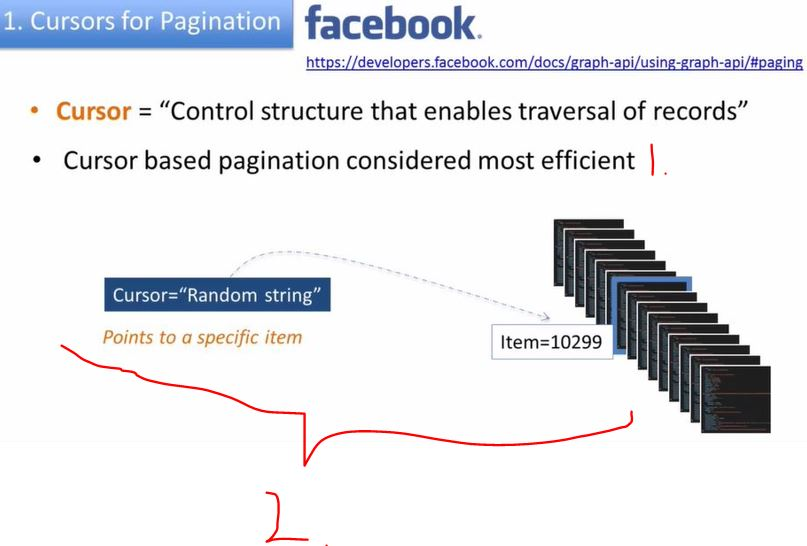

# Section 08 - REST API Response Data Handling Patterns

# What I Learned

1. Exposing REST API, same can be accessed thought website or mobile application 
2. Same data will have different amount space to show 

1. **REST client** is in control of **granularity** of the data.    
    - **x, y, z** will be returned form REST Server API 

Partial Responses gives benefits: (**Example mobile applications**)
    - Better performance
    - Optimal use of CPU/Memory
    - Low battery usage
- We can make **common endpoint** for all REST clients

- In API implantation, It's needed to support **partial responses**

1. One way is to write **Partial Response Support**

2. Or use external things like **GraphQL**

- When making call to API   
    - There are two ways to call them. With **Projections** or with **Filters**

1. LinkedIn API consumer requires for **Field Projections**
2. Only **firstname** and **lastname** will be returned to API consumer

- There special rules for these **Projections**

[LinkedIn Projections](https://learn.microsoft.com/en-us/linkedin/shared/api-guide/concepts/projections)

1. Example in fields Field Projections.
    - Return me **id** and **beeb** of object **baz** fields

- Example MeetUp service

- Depending on resource **expression** based query work for you or whether **field filters** based query work for you!

### Summary

- API usually return full response to client

- If supports partial responses
    - API return only interested fields for **API consumer**
    - Better performance for Mobile Applications
- This can be achieved by using **Field Projections** and **Filters**

1. Case study has quite big data
2. Query parameters will be used for mobile application

1. **Pagination** gives control of responses, like **partial responses**. If API supports **pagination** app developers gets decide how many rows it will receive.
2. Website has more screen to view, it will want to get more rows.
3. Mobile in other hand has less space, it will only want what is needed.

1. App developer decides to return all **pages**
2. App developer decides to **return only page 2** 
    - Number of rows are restricted to page.

- Benefits for using pagination.
    - CPU, Memory, Bandwidth
    - Common API version for all consumers
        - Multiple user cases, devices

 - **Three** Common ways REST API:s implements pagination

 1. Most popular nowadays pagination way
 2. The Least popular nowadays pagination way
 

