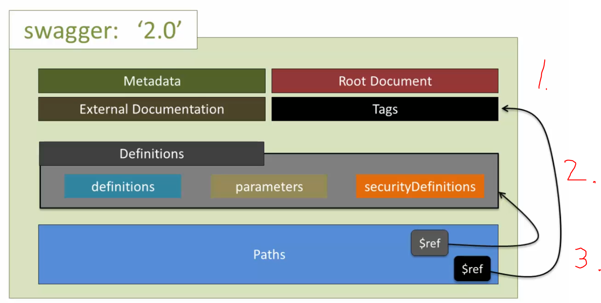

# Section 10 - REST API Specifications using Swagger 2.0 / OAI

# What I Learned

1. One way to generate documentation is thought code `@annotation`, which generates documentation 
2. Other way is to write documentation, which in regards generates `@annotation` documentation code to the code

- This is the **iterative** processes to create REST API specification which is needed between **2.** App developer and **1.** API developer

- There is many REST API standards, but which is currently becoming the most popular is **Swagger** **1.**

- Writing swagger documentation can help to generate different documentations/codes/configurations 

- [SwaggerSpesifications](https://swagger.io/specification/)
- [Yaml](https://yaml.org/)

- **YML** is much clearer to write 

- It's recommended write specification wit **YML**

- Online tool for creating Swagger specifications [YML Editor](https://editor.swagger.io/)

- [Swagger](https://www.npmjs.com/package/swagger)
- [Swagger Editor](https://www.npmjs.com/package/swagger-editor)

- API is being build, while defining API specification.

- There is many other API specifications Standards, but most popular and used currently is Swagger **1.**

- Three parts what we are going through

- Example used in this course [Link to repo](https://github.com/acloudfan/REST-API-Course-API-Management)

## Swagger 2.0 portions part 1

 

 

 

## Swagger 2.0 portions part 2

- There are three parts in **Definitions**. **Definitions**, **Parameters** and **Security Dedications**
    - **Definitions** has requests and responses 
    - **Parameters** how request data is received
    - **Security Dedications** defines security schemes

 

1. Mocking can be written on examples which is written in this documentation

 

## Swagger 2.0 portions part 3

 

 

 

- Easy to write beautiful document for app developers in no time!
